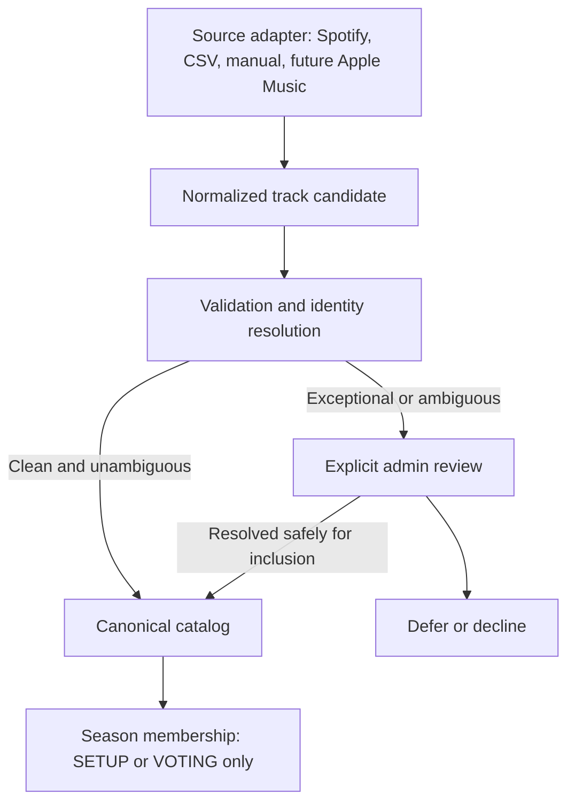

# Catalog ingestion design

Status: **accepted product rules with implementation recommendations; ingestion is not implemented**. Finalized 2026-10-07 after the Core Voting UX milestone. Accepted rules below supersede the initial design proposals; schema, CLI, authentication, and persistence choices remain recommendations. No provider calls, downloads, OAuth implementation, migrations, or import code were added for this design.

## Existing accepted boundaries

The application uses internal UUIDs, private season membership, protected raw votes, and season-level locking. Catalog growth is allowed in SETUP and VOTING. Current votes and immutable vote events must survive additions. Completion and the unrated queue are derived. Application admins cannot read other members’ choices, including after REVEAL. Those contracts remain accepted; the recommendations below do not replace them. See [architecture](architecture.md), [data model](data-model.md), and [decision record](decisions.md).

## Accepted ingestion decisions (2026-10-07)

- Each season may designate one Spotify playlist as its primary initial ingestion source. Canonical storage remains provider-neutral and supports future manual/CSV, Apple Music, other providers, and internal/admin-created entries.
- Permanent internal UUIDs identify canonical recordings and artists. Provider IDs are mappings only; metadata changes never change the canonical vote target.
- **Different released musical versions MUST be separate canonical tracks.** Originals, remixes, edits, extended mixes, radio edits, distinct released bootlegs, VIPs, live/acoustic/rework variants, and any other distinct released versions cannot be collapsed by title, artist text/lists, duration, album, formatting, naming conventions, or shared ISRC.
- Exact known provider identities reuse accepted mappings and canonical records. Similar metadata and ISRC create review candidates, never automatic equivalence. When uncertain, separate records are safer than a wrong merge.
- A release-year mismatch is a reviewable warning, never automatic rejection or silent exclusion. An admin can explicitly include the item.
- The initial Spotify market is **IL**, configurable at the season/ingestion boundary; identity logic must not embed that default.
- If either suspected duplicate has vote history in any season, preserve both canonical tracks, memberships, votes, and events. No automatic merge, deletion, vote movement, history rewrite, or silent deactivation; flag for explicit administrative review.
- Reimports must be idempotent for known provider identities and memberships. Catalog growth during VOTING preserves votes/events and naturally creates new unrated work; completion is not permanent.

The following implementation recommendations serve these rules without granting permission to implement them in this documentation task.

## Accepted admission and lifecycle refinement

The designated playlist is an additive, authoritative source for normal releases. In an apply run, clean, unambiguous candidates are admitted automatically after validation and identity checks; **no per-track admin approval is required**. Only exceptions enter `review_required`: release-year mismatches, suspected duplicate/match candidates, materially inconsistent identity metadata, or insufficient metadata to identify a recording confidently.

Suspected duplicates must neither merge nor enter the season automatically. Admin review may admit a distinct recording separately, safely attach/resolve a provider mapping to an existing canonical track, or defer/decline the candidate. Review exposes catalog evidence only, never pre-REVEAL group preferences; existing raw-vote privacy also remains unchanged after REVEAL.

New season memberships are allowed only in SETUP or VOTING, never LOCKED or REVEAL. Playlist disappearance does not remove, deactivate, delete, or change the votes of an admitted track. An admin may replace the designated playlist only during SETUP/VOTING: record actor, timestamp, and old/new source; the replacement affects future imports only and preserves all admitted tracks. The intended change is auditable, not an automatic sync deletion.

Spotify IL playability is an availability observation, not season eligibility. Flag unavailable/restricted items, but automatically admit them if otherwise clean and identifiable; apply ordinary exception review when needed. Missing usable identity/metadata requires review, not an invented recording. Clearly non-identity-changing provider URL, artwork, availability, and album/release observations may refresh automatically. Material title, artist-credit identity, or version/remix changes require review and never silently repoint a voted recording.

### Future audited withdrawal — accepted behavior, not implemented

During SETUP/VOTING, an admin may explicitly withdraw a mistakenly admitted season track. Preserve the canonical track, season association, all votes, and vote events; stop offering it for new voting and exclude it from eventual scoring/results. Retain it in appropriate personal historical views with a withdrawn/ineligible status. Withdrawal is season-scoped, not a canonical merge or deletion, and is never inferred from playlist removal or suspected duplication. Normal withdrawal is forbidden in LOCKED/REVEAL; exceptional post-lock corrections remain future policy.

Recommend recording actor, timestamp, reason, and prior/new eligibility under the existing season lock, coordinating withdrawal with voting and locking transitions. Active-catalog progress continues to be derived; this refinement does not authorize deleting votes or automatically refunding Super Likes (current usage counts retained votes). Reimports must not reactivate withdrawn memberships. Withdrawal storage/API/UI work is a separate future implementation, not part of the first importer.

## Current schema and loader review

| Existing object | Actual behavior | Implication for ingestion |
| --- | --- | --- |
| `tracks` | UUID primary key; nonblank title; nullable artwork, Spotify, Apple Music URLs; creation timestamp. No ISRC, duration, version, release date, or provider ID constraints. | Stable vote target already exists; URLs alone are insufficient identity. |
| `artists` | UUID primary key and nonblank name; name is not unique. | Correctly permits different artists with identical names, but needs reusable provider identity. |
| `track_artists` | Primary key `(track_id, artist_id)`; unique `(track_id, credit_order)`; nonnegative order; artist lookup index. | Preserves ordered collaborations. No structured primary/featured/remixer roles yet. |
| `season_tracks` | Primary key `(season_id, track_id)`; active flag, adding actor/time, track lookup index. | Prevents duplicate season membership and supports growth without changing track identity. No deactivation API exists. |
| `votes` / `vote_events` | Votes reference season membership and season track; events reference votes. Restrictive foreign keys, immutable audit events, deferred consistency checks. | Never change these relationships to accommodate an import. |
| `add_track` | Admin-only SETUP/VOTING operation, locking season; creates a new track and a new artist row for every supplied name. | Intentionally not an identity resolver or deduplicating importer. |
| `add_existing_track` | Locks/checks admin season; requires existing track visibility through the caller’s membership; repeated association is harmless. | Preserve the visibility boundary; do not turn it into arbitrary catalog discovery. |

The [development loader](../scripts/seed-dev-catalog.py) adds 12 explicitly marked fictional tracks. It checks exact fixture titles within a locked local season and skips repeats. This is fixture convenience, not a general matching rule: repeated artist names create separate rows, and title equality cannot establish recording identity. Keep fixtures separate; never guess real-provider mappings for DEV tracks.

## Proposed pipeline

Adapters fetch and translate external data. They do not create canonical IDs, infer votes, or write season membership directly. A shared resolver produces a reviewable import plan. A small transactional writer revalidates the plan and automatically admits clean candidates, plus explicitly approved exceptions. Starting an apply run is not per-track approval. Network work happens outside database locks.

A normalized candidate should carry:

- Source namespace, source object ID, source playlist/file ID, occurrence position, observed time, adapter version, and optional playlist snapshot ID.
- Unmodified display title, optional base title and explicit version/mix label, ordered artist credits with provider IDs and names, and known credit roles (otherwise unknown).
- Optional duration in milliseconds; ISRC observations with source; release date plus precision and release/album context; validated provider links and artwork URLs.
- Availability/market context, optional original and relinked provider IDs, and validation warnings. Missing optional data is null, never fabricated.

Trim surrounding whitespace and reject blank required display values; preserve meaningful punctuation and version labels. Matching-only normalization can case-fold/collapse whitespace, but never overwrites display text or proves identity. Do not split artist identities by parsing `&`, commas, or `feat.` in names. Validate IDs within their provider namespace and URLs by HTTPS/provider host rules. Treat imported text as data, not HTML or executable instructions.

## Canonical track identity

**Accepted identity rule:** one permanent internal `tracks.id` UUID identifies one recording/version accepted into this catalog. It is independent of album appearance, playlist position, provider availability, and provider ID. It remains the vote foreign-key target permanently.

| Identifier or signal | Recommended use |
| --- | --- |
| Internal UUID | Sole canonical database identity and vote target. |
| Spotify / Apple Music track ID | Exact identity inside a provider namespace; mapping to internal UUID, never the primary application key. Multiple provider IDs may map to one recording after review. |
| ISRC | Strong candidate signal with provenance, not a unique canonical key and never an automatic cross-provider merge instruction. Missing, conflicting, or reused observations are allowed to trigger review. |
| Title and version | Evidence for review; retain remix, radio edit, extended mix, live, instrumental, remaster, and clean/explicit distinctions. |
| Artists | Compare resolved artist identities and version-specific credits, not concatenated display strings. |
| Duration | Supporting evidence or conflict warning. No universal tolerance alone approves a match. |
| Release date | Eligibility/release-context signal, including year/month/day precision; a compilation date does not establish recording identity. |

An already-known provider ID resolves exactly to its recorded UUID. A material metadata contradiction on that ID is quarantined for review rather than remapping it. For a new provider ID, matching ISRC/title/artists/duration can propose an existing recording. Ambiguity remains in staging with no new season membership until resolved. A clean, clearly distinct recording receives a new UUID and season membership automatically during apply in SETUP/VOTING. The reviewer can approve a new provider mapping to an existing recording only when it is the same released musical version; this does not merge two canonical rows. Otherwise the reviewer can explicitly create a separate canonical track or defer/decline the item. Retain evidence and reason, including a “keep separate” decision so a rerun does not repeatedly raise the same ambiguity.

Different released versions MUST remain separate, even with a common base title or the same ISRC. This is a firm rule, not a heuristic that a metadata score can override. A re-release or compilation appearance may map to the same UUID only when identity is established; store its release metadata on the provider record. A year filter must not automatically infer the original release year from a compilation.

## Release-year review and source configuration

Accepted behavior: compare a known provider release year to the season year and flag differences. Do not reject an item merely for a mismatch or silently omit it from the report. Compilation, album, re-release, and distributor dates can describe a different context from the relevant recording/version. A missing or imprecise date is reported as unknown; never invent a precise date.

Recommended exception path: dry-run lists the reported date/precision, season year, and warning. Apply requires an explicit per-item include decision for mismatches, recorded with actor and a short reason; unresolved entries remain visibly pending review while approved entries can proceed. This is a review gate, not an automatic eligibility rejection. Persist accepted exceptions against season/provider identity plus the reviewed date evidence; identical reruns reuse them, changed evidence prompts fresh review. Existing membership is never removed because a refreshed date differs. No eligibility rules engine is needed.

Recommend a small season-source configuration record: season ID, primary provider/source ID, and default market, with at most one designated primary source per season. Spotify is the first adapter, not a schema-wide requirement. Initialize the Spotify market to `IL`; permit an explicit ingestion override and record the effective market in the plan/run. A supplied playlist URL is parsed to its ID, not fetched as an arbitrary URL. A supplied ID differing from the configured primary source must require explicit designation/confirmation, never silently replace configuration. Designated-playlist replacement is an explicit audited admin operation allowed only in SETUP/VOTING, affecting future imports only. Plans record the source configuration version; if it changes before apply, rescan/replan instead of applying a stale source plan. This configuration does not change canonical identity or erase prior memberships.

## Artist identity and ordered credits

Use canonical artist UUIDs plus provider artist mappings. Exact mapped provider IDs reuse artists; same name alone never merges them. A new unmapped artist whose name collides with an existing artist becomes a review candidate, not an automatic merge. Different providers’ artist IDs require an explicit approved mapping. A stable provider ID with a changed name preserves artist identity; record the observed name and propose a display-name update.

For collaborations, retain separate artists and source credit order. Formatting or ordering differences do not create new artist identities. Canonical credit order is chosen on initial admission and not overwritten by refresh. Preserve each provider’s observed order separately for review. Feature/remixer roles are optional evidence; do not invent them when the provider only supplies an ordered list. One artist credited twice is represented once in the existing join, with multiple observed roles if needed later.

This allows later Artist of the Year grouping by canonical artist UUID without prematurely deciding how primary, featured, and remix credits receive points. Alias history and richer roles can be added later; a general artist taxonomy is unnecessary for the first import.

## Deduplication and idempotency

| Situation | Proposed action |
| --- | --- |
| Same provider track repeated in a playlist | Count repeated occurrences, resolve once, create at most one season association. |
| Same provider track imported again | Reuse provider mapping and canonical UUID; refresh allowed observations only. |
| New provider ID with same ISRC, including another provider | Propose a match; hold ambiguous entry outside active catalog pending review. Never automatically merge. |
| Remix/edit/radio/extended or other distinct released version | MUST have a separate canonical track; shared ISRC cannot override version differences. |
| Compilation/re-release | Keep appearance metadata on provider record; approve reuse only with adequate evidence. |
| Credit spelling/order variation | Resolve artist IDs; preserve display/credit observations; no name-only merging. |
| Provider relinking | Preserve original and returned IDs when supplied; require an explicit equivalence decision before adding a second mapping. Never silently repoint a known ID. |
| Provider/manual data without stable ID | Require a source namespace and durable source-row key for repeatability. A content hash detects changes but is not a recording identity. |

Enforce unique `(provider, external_id)` keys separately for track and artist mappings. Keep the existing unique season/track association. Do not rely on a read-before-insert check without constraints. The writer should serialize import writers with one private import transaction lock, then lock the target season using the existing ordering boundary. No network waits while either is held. All future correction writers must share that order. Voting does not take the import lock, so its actor-then-season order is unchanged.

After waiting, resolve keys again under READ COMMITTED. Concurrent imports of the same provider ID must converge on one UUID and one membership, rolling back any speculative rows on conflict. A retry of a completed item returns its persisted outcome; a changed item payload under the same import-item key is rejected. Import receipt keys are separate from vote action UUIDs.

Assuming 850 unique valid recordings with resolved identities:

| Run | Canonical effect | Season effect | Votes |
| --- | --- | --- | --- |
| First 850 | Create 850 tracks and only distinct resolved artists. | Add 850 memberships. | Untouched. |
| Identical 850 | Create zero tracks/artists. | Add zero; report 850 already present. | Untouched. |
| Later 875, including 25 genuinely new recordings | Reuse 850; create 25. | Add 25; retain previous memberships. | Existing choices, versions, UUID receipts, and events unchanged. |

Previously caught-up members now have 25 unrated tracks. Source deletions, playlist reordering, or a failed/incomplete fetch do not remove or deactivate season tracks. An inactive membership is not silently reactivated. Counts differ when candidates require review or map to an existing recording; the report must explain that difference.

## Metadata ownership and proposed schema

These are **additive migration recommendations for a later implementation**, not current tables or approved migrations.

| Object | Recommended responsibility and constraints |
| --- | --- |
| Existing `tracks` | Stable UUID and curated display title; optionally approved version label and duration. Preserve current URL columns initially as chosen display projections so rating/My Picks contracts need not change. |
| Proposed private `track_provider_mappings` | `canonical_track_id` restrictive FK, unique `(provider, provider_track_id)`, `provider_url`, `first_seen_at`/`updated_at`, observed title/credits, ISRC, duration, release date/precision and album context, external/artwork URL, market/availability, fetched time, provenance. Multiple mappings per track. Index normalized ISRC non-uniquely for candidate lookup. |
| Proposed private `artist_provider_mappings` | `canonical_artist_id` restrictive FK, unique `(provider, provider_artist_id)`, observed name/URL, first/last observation timestamps and provenance. Names remain nonunique. |
| Existing `track_artists` | Canonical ordered credits; keep current PK/order constraints. Role expansion is optional and can wait. |
| Proposed private `season_catalog_sources` | Season FK, primary provider/source ID and configured market; one designated primary source per season. Recommended storage shape, not an existing table. |
| Proposed private `catalog_imports` | Import UUID, mode (`dry-run`/`apply`), acting admin, season, source identifier, adapter version, snapshot/market, plan checksum, optional originating dry-run ID, start/finish, status and counters. No OAuth tokens or raw preferences. |
| Proposed private `catalog_import_items` | Unique import/occurrence key, normalized candidate or minimal retained evidence, validation outcome, resolved track UUID, payload checksum, durable apply result/error/review reason and explicit release-year inclusion evidence. Repeated source occurrences can point to a representative item. |

Use explicit grants/revocations. Raw provider observations, review records, and import logs should not become new public Data API tables. Members keep reading the existing catalog projection under existing membership RLS. The first operator tool should use the already-accepted owner trust boundary locally, record the intended season admin, and verify membership/season state in the database; it must never expose owner credentials in the frontend. Restrict the import writer to the operator role initially. A future application-admin RPC requires a separate security review and must preserve the existing cross-season catalog visibility boundary. Returning hidden catalog metadata or vote details through match errors is forbidden.

Provider refresh updates observed fields and timestamps, not the mapping target, canonical title/version/credits, or vote relations. On first creation choose canonical display metadata; after that curated values win. An explicitly approved correction may change display metadata with before/after evidence. Cosmetic fixes must be distinguished from changing which recording the user heard. Existing Spotify/Apple Music/artwork columns remain compatibility projections of approved selections, not identity keys or independent dedupe sources. Preserve manually entered legacy URLs; propose mappings only after verifying their IDs. Do not bulk merge existing artists by name.

### Metadata refresh: accepted boundary and recommended field handling

Refresh provider observations separately from approved canonical display metadata. A changed observation is evidence, not permission to change the recording that members rated.

| Field | Automatic refresh allowed | Review required |
| --- | --- | --- |
| Provider URL | Validated link for the same mapped provider ID; update uncurated display projection if that mapping is selected. | Different ID/recording, redirect ambiguity, or replacement of an admin override. |
| Artwork URL | For the same unchanged mapping, update its URL and selected uncurated display projection after URL validation; keep fallback on failure. | Mapping is quarantined or evidence suggests a different recording. |
| Availability / market | Update provider observation; IL restriction alone neither blocks admission nor changes membership. | Identity-changing listening-link substitution, not playability itself. |
| Album / release date | Update observed values and preserve review evidence; flag new year mismatch without removing membership. | Changing approved canonical interpretation or including an unresolved mismatch. |
| Duration | Record new provider observation; do not automatically change canonical duration. | A changed duration may imply another edit/version; flag for review. |
| Title / version | Record proposed observation, preserving approved display title/version. | Canonical title/version changes, including apparently cosmetic changes. |
| Artist names / ordered credits | Record observed names/order; exact mappings retain artist UUIDs. | Canonical rename, credit changes, or mapping reassignment. Never merge by name. |
| ISRC | Record with provenance, no uniqueness assumption. | New/conflicting ISRC proposes review, never an identity merge. |

If any identity-sensitive observation materially contradicts an existing mapping, flag/quarantine the new observations and freeze display projection refresh for that item until reviewed. Do not replace its accepted metadata with a potentially different recording. Canonical UUIDs and vote references are never refreshable fields.

Keep ISRC observations per mapping first; do not add a unique `tracks.isrc`. Add a canonical chosen ISRC later only if useful, with provenance. Release and album tables, a queue service, fuzzy-match service, or event bus are unnecessary for this POC.

## Protecting voted tracks and manual corrections

Import additions and provider observations must never update `votes`, `vote_events`, their versions, or accepted-action receipts. “Has vote history” means either canonical track has any votes or vote events in any season, not just the import target. Because the same canonical UUID can be shared across seasons, canonical corrections affect more than one catalog.

| Correction | Before any votes/events | After any votes/events |
| --- | --- | --- |
| Wrong provider match | Explicit reviewed reassignment with audit evidence and collision checks. | Quarantine misleading link/metadata; preserve original UUID and vote target. Do not repoint identity automatically. |
| Duplicate canonical tracks | Prefer an explicit reviewed mapping consolidation; recheck every affected season and reference under locks. Not an initial importer operation. | Flag for owner review; retain both records and all history. No vote consolidation, deletion, or automatic scoring adjustment. |
| Bad artist mapping/credits | Reviewed correction with stable artist IDs and source evidence. | Explicit review because attribution affects later artist results; preserve votes and audit the metadata change. |
| Missing Apple Music link | Approve a new mapping, then select its display URL. | Same non-destructive enrichment, verifying the recording/version. |
| Mistakenly admitted season track | Explicit audited withdrawal in SETUP/VOTING; preserve canonical row and season association. | Same withdrawal window; preserve all votes/events, retain personal withdrawn history, exclude from new voting and eventual results. No normal withdrawal after locking. |

Pre-vote status must be rechecked transactionally, not assumed from an earlier preview. Any future correction spanning multiple seasons must lock all affected season rows in deterministic UUID order, then recheck votes, to avoid racing a vote. Catalog-wide transformations require a dedicated operation and tests; do not add them to the first importer. Even before votes, automatic deletion is unnecessary. Represent a suspected duplicate as a private unresolved review item containing both canonical UUIDs, provider IDs, evidence/reason, discovery time/run, and review status. Deduplicate repeated pair reports. Keep it unresolved until explicit review; no vote choices or per-user history belong in the report. The first importer can retain these records in its minimal review/item storage, without a review UI or reconciliation engine. After votes, suspected duplicates remain flagged until a separately approved reconciliation policy exists. Never combine choices, choose a winning vote, reset users to unrated, or rewrite events to hide a correction.

## Artwork and listening links

Prefer artwork from the selected Spotify mapping for the first importer; preserve any explicit admin-selected artwork. Store source/fetched time. Future approved provider artwork can be selected without changing identity. Use the existing safe placeholder on absence or load failure. URLs can expire/change; refresh from the same accepted mapping may automatically update an uncurated selected URL under the metadata policy above. Do not copy images, build a proxy/cache, or download audio in the POC. Any later caching must account for provider terms, retention, and invalidation. Spotify metadata/artwork display must retain appropriate attribution and links; review the [Spotify Developer Policy](https://developer.spotify.com/policy) before real-data rollout. No provider policy assumption here authorizes permanent mirroring.

Store only verified listening links. Missing Apple Music remains unavailable rather than linking to a search result presented as an exact match. Continue opening provider links externally; no playback scopes or embedded playback.

## Proposed first Spotify workflow

Current documentation review (2026-10-07): use the [playlist items endpoint](https://developer.spotify.com/documentation/web-api/reference/get-playlists-items), with pagination and item-type checks. The older `/tracks` endpoint is deprecated. Keep endpoint/response-shape handling in the adapter, not the canonical model.

The [2026 Development Mode migration guide](https://developer.spotify.com/documentation/web-api/tutorials/february-2026-migration-guide) restricts playlist contents to playlists the authenticated user owns or collaborates on; it also specifies a Premium app owner and a five-user limit for new apps. It removes some fields such as `linked_from`; therefore relinking evidence cannot be required. Confirm the actual app mode and source access before implementing around an arbitrary public playlist. Fifteen ranking members do not need Spotify authorization; only the importer’s operator does.

**Recommendation:** an explicitly invoked owner/admin CLI with Spotify Authorization Code + PKCE for one operator, storing tokens only in ignored local state. Request only required playlist-read scopes. Client Credentials is simpler when an endpoint genuinely permits app-only metadata access, but does not grant an operator’s private/collaborative playlist access. A local script is the execution form, not a separate authentication grant; use the same admin PKCE flow with protected ignored token storage. Do not use pasted long-lived access tokens as the operating model. Avoid a public callback service or member-facing Spotify OAuth. The [authorization guide](https://developer.spotify.com/documentation/web-api/concepts/authorization) distinguishes user authorization from client credentials; client credentials are not the recommended default for an owned/collaborative playlist workflow. Keep Spotify credentials independent of Google/Supabase auth. Local-only operation is the first target; remote writes require a separately configured, explicit target and verified backup readiness.

The proposed CLI accepts a season identifier and Spotify playlist URL or ID, with explicit `dry-run` and `apply` modes. Dry-run performs no canonical, mapping, membership, or vote writes; private run/review bookkeeping is allowed and reported. Apply consumes the plan, automatically processes clean candidates, and applies explicit decisions only for exceptions. Dry-run identifies these buckets without requiring hundreds of individual approvals. Neither mode changes Google authentication.

1. Operator supplies season UUID and playlist URL/ID; load the configured market (initially `IL`) or an explicit override, and record effective access context. Validate configured endpoints; do not fetch arbitrary supplied URLs. Verify operator authority and SETUP/VOTING state.
2. Read playlist metadata/snapshot and all pages, following validated provider pagination. Recheck snapshot after scanning; if changed, discard the incomplete plan and rescan with bounded retries. No writes from a partial scan. A snapshot marker is an observation, not a guarantee that offset pages form an atomic snapshot.
3. Normalize all entries, preserving occurrence count and stable IDs. Null/removed entries and malformed recording identity/metadata receive explicit review-required outcomes; unsupported local files or episodes/nontrack types are reported as skipped. None removes an existing membership. Missing artwork, ISRC, or Apple Music link is allowed. IL-unavailable recordings with stable, sufficient identity remain eligible for automatic admission when otherwise clean; insufficient identity stays in review; provider removal never erases existing catalog data.
4. Detect duplicate playlist occurrences, validate metadata/year, resolve exact Spotify identities, and identify conservative match candidates. Plan reusable/new canonical artists and tracks, mappings, and memberships in that order. Produce a dry-run summary and item-level decisions, including distinct versions and release-year exceptions. Classify clean candidates as auto-admissible and exceptional/ambiguous candidates as review-required. Bind the apply run and exception decisions to the plan checksum so a changed playlist is not silently substituted.
5. Automatically apply clean items and explicitly approved exceptions through short transactions; hold unresolved exceptions without blocking clean items. Recheck identity keys, current season state and authority at write time. Atomically create canonical rows/mappings/credits, add season membership, and record the item result. Repeated keys and lost responses recover from persisted results. Reject changed payloads for an already-applied item.
6. Report complete, partial, failed, or interrupted accurately. If the season locks mid-run, committed additions remain; later items fail cleanly. Rerun auto-admissible or explicitly approved pending items safely without rolling back committed history. A crash after commit but before CLI acknowledgement reads the durable item result.

On HTTP 429 honor `Retry-After`; use bounded backoff/jitter for transient network/5xx failures, and stop with a resumable error after the retry budget. Do not loop on authorization failures. This follows Spotify’s [rate-limit guidance](https://developer.spotify.com/documentation/web-api/concepts/rate-limits). Persist only necessary staging/checkpoint information locally or in private import records, with a documented retention period; exclude tokens, headers, private playlist owner details, and complete response dumps from logs.

When supplied, original/relinked identifiers are separate observations as described by Spotify’s [track-relinking documentation](https://developer.spotify.com/documentation/web-api/concepts/track-relinking). Their presence suggests reviewable equivalence; absence is not proof of a new recording. Do not assume the broad reference schema guarantees every field for Development Mode.

## Minimal reporting and audit

One import summary plus item outcomes is enough. No event infrastructure is required. Preserve source, snapshot/plan checksum, actor, time, counts, created/resolved IDs, reasons, and sanitized errors. A correction records before/after IDs and reason. Do not include members’ choices or provider tokens.

Recommend persisting one lightweight run record for both modes, with mode, actor, season/source, effective market, timestamps, snapshot/checksum, status, and summary counts. Apply references the dry-run plan; it revalidates authority/state and never treats the preview as a reservation. Retain minimal item results for safe retries and review evidence, not complete raw provider dumps. A summary alone cannot recover an uncertain per-item commit, which is why item receipts are recommended. Keep interrupted/partial runs explicitly distinguishable from successful ones. No scheduler or event/logging platform is needed.

Report auto-admissible, review-required, explicitly included, deferred/declined, and already-withdrawn outcomes separately. Report scanned entries, unique valid Spotify IDs, duplicate occurrences, known provider IDs, new/reused canonical tracks and artists, new mappings, added/already-present season memberships, release-year warnings and accepted/pending exceptions, match-review items, unavailable/removed items, and terminal errors. Counts of warnings, known IDs, and creation outcomes are separate dimensions; they can overlap and must not be summed as occurrence totals.

Define mutually exclusive occurrence outcomes so totals are checkable. Example:

| Scan outcome | Count |
| --- | ---: |
| Ready, first occurrence of provider ID | 892 |
| Duplicate playlist occurrences | 9 |
| Needs identity/eligibility review | 7 |
| Invalid/skipped entries | 4 |
| **Total occurrences scanned** | **912** |

The 892 ready entries might resolve to 34 newly created plus 858 existing canonical tracks, assuming no further many-to-one approved mappings. Of those 892 distinct canonical tracks, 40 may be newly added to the target season and 852 already present. These are separate dimensions, not quantities to add to the scan total. Report distinct resolved canonical count explicitly when several provider IDs map to one track. New artist count is another independent dimension.

For apply progress, `eligible-to-apply items = applied + failed + pending` (clean auto-admissible items plus explicitly approved exceptions); applied includes created and reused results. Unfinished page fetches report pages/occurrences observed, not a successful full-playlist count. Report rate-limit retries separately from terminal item errors. Reruns must report zero new records when all approved identities and memberships already exist.

## Apple Music and other adapters

Apple Music IDs belong in the same provider mapping model, with storefront context kept in observations/links rather than conflated with a recording UUID. Apple provides [catalog-song lookup by ISRC](https://developer.apple.com/documentation/applemusicapi/get-multiple-catalog-songs-by-isrc); candidate lookup is not proof of the same version. The friend’s link-mapping script can later emit candidates/evidence into the resolver. It must not write vote targets or bypass review. No dependency on that script belongs in the canonical schema.

CSV/manual sources should use their own durable namespaces and source keys; changing row order must not change identity. A later Apple Music-only import can create canonical records without any Spotify field, using the same review and write path.

## Explicit recommendations for the ten design questions

1. **Canonical identity:** internal UUID for one recording/version; retain permanently once used.
2. **Spotify IDs:** unique provider mapping keys pointing to internal UUIDs; many approved IDs may reference one recording.
3. **ISRC:** candidate evidence only; no automatic merge and no canonical uniqueness constraint.
4. **Versions:** distinct released musical versions MUST have separate UUIDs; metadata similarity and ISRC cannot collapse them.
5. **Repeated imports:** mapping constraints, season association PK, serialized transactional resolution, durable item receipts, stable source keys.
6. **Late releases:** automatic clean admission or reviewed exception admission only in SETUP/VOTING; old votes remain and the derived queue finds additions. LOCKED/REVEAL admit nothing new.
7. **Metadata updates:** refresh observations; preserve curated canonical values and stable identity; review material changes.
8. **Vote protection:** no import writes to votes/events and no automatic delete, merge, repoint, deactivation, or rerating.
9. **Schema first:** additive private source configuration, track/artist mapping and import/item records, optional canonical version/duration fields, narrow operator write boundary with explicit grants. No vote schema changes.
10. **First implementation:** one local operator CLI, one accessible playlist, dry-run plus apply with automatic clean admission, exact-ID reuse, exception-only review, safe repeated/growing imports, and targeted integrity tests. No automatic equivalence/merging, UI, or playback.

## Remaining questions and operational inputs

**No unresolved product-policy question blocks implementing the first importer.** Automatic clean admission, exception-only review, lifecycle limits, additive source replacement/removal, future withdrawal, availability independence, and metadata refresh boundaries are decided, alongside identity/version/year rules. Do not reopen them as implementation questions. Table layouts, review-plan format, bounded retries, and minimal persistence above are engineering recommendations.

Before a real import, the operator must supply the designated playlist URL/ID and an account/app with permitted access. This is configuration/access verification, not a missing product rule and does not block development against fixtures. Proposed operational default: use one admin-owned or collaborative playlist; if access is unavailable, report the failure and request a usable source rather than silently substituting one. Access matters because the importer cannot reliably fetch a source the provider withholds.

Destructive reconciliation, scoring treatment of duplicates, and Apple Music storefront selection are outside the first importer; no decision about them is needed to implement the accepted preserve-and-review behavior. Production backup/restore verification and the real two-Google-account forwarded-invitation check remain pre-pilot work; this design does not mark either completed.

## Bounded next implementation task

Proposed scope for a separately authorized implementation: provider-neutral identity storage and one local/admin Spotify import CLI accepting season plus playlist URL/ID, with `dry-run` and `apply`. Add the minimal additive migration and guarded writer, preserve current read API projections, then implement the accessible-playlist adapter and plan/apply report. Include source/market configuration, track/artist provider mappings, minimal run/item persistence, pagination, duplicate-occurrence detection, exact Spotify-ID reuse, conservative review candidates, explicit year-exception inclusion, safe metadata refresh, guarded membership creation, and import reporting. Out of scope: withdrawal API/UI (accepted future behavior only), correction/merge tooling, automatic cross-provider matching, admin web UI, member Spotify OAuth, Apple Music API, artwork caching, scheduled sync, playback, scoring/results, and Party Mode. Start with a small controlled playlist before the full catalog.

Acceptance tests should cover automatic admission of hundreds of clean candidates without individual approval; exception-only holds; no admission in LOCKED/REVEAL; non-destructive playlist removal/replacement and stale-source plans; IL-unavailable but identifiable tracks; no reactivation of withdrawn membership; repeated IDs/artist reuse; distinct same-name artists; distinct original/remix/edit/extended/radio/VIP versions even with shared ISRC; same-ISRC ambiguity; year mismatch reporting, explicit inclusion and repeated-exception recovery; IL default/override isolation; safe versus identity-sensitive metadata refresh; exact 850/850/875 idempotency scenarios with synthetic candidates; concurrent imports; interrupted fetch/apply and lost acknowledgements; unchanged vote/event/version data; catalog growth; lock races; malformed/local/nontrack/missing fields; permission boundaries and sanitized reporting. Use mocked provider responses plus the real isolated database/Data API, and a separately authorized small live-source smoke check. Do not require Spotify credentials in normal CI. Preserve every existing voting/auth test and the season/READ COMMITTED/UUID contracts.
